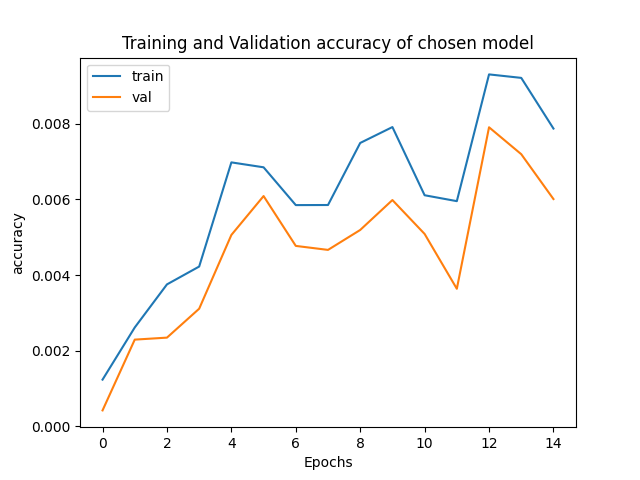
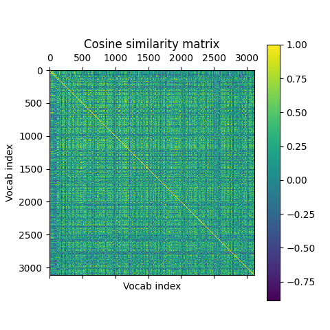

# Introduction
This report aims to explain our approach and design choices for defining, training and evaluating sequence models for three language modelling tasks. Additionally, we will discuss the performance of our models and evaluate our implementations.

For general information and setup guidance, please refer to the [README](README.md).

## Contributions
There is some overlap, but here is a general overview of what each project member contributed with: 

- **Simon Vedaa**: Word embedding and conjugation modelling, loss functions, preprocessing, model training, evaluation and selection, plotting, documentation and project report
- **Sebastion Røkholt**: Generation modelling, beam search, model evaluation, code documentation and report

\newpage

# Task 1: Word embeddings

## Approach and design choices

### Tokenization

For tokenization we are using the basic-english tokenizer from `torchtext`.
We exclude tokens which are digits, names, and spaces.
Only words that appear 90 times or more are used in our vocabulary.

### Dataset

The training dataset contains 4,384,460 words, and has 80,135 distinct words.
The defined vocabulary contains 3,110 words. 
Many words then become unkown words, and could affect performance.
The context, target training dataset contains 3,225,478 pairs.

When creating the context, target pairs, we have used a context size of 12.
The context size refers to the number of tokens before and after the target.
The total context then becomes 2*context_size.
Unkown tokens (`<unk>`), and punctuations are excluded from the targets.

### CBOW Architecture

We have defined two CBOW architectures, `CBOW` and `CBOWDeep`. Both take the vocab size, context size, and 
embedding dimension as parameters. The first layer is a `nn.Embedding` for both.

`CBOW` contains two fully connected layers after the embedding layer, while `CBOWDeep` contains four.
Relu is used as the activation function, and the last layer is passed through a log_softmax layer.

\newpage

## Training and Selection

### Training data
In addition to the 13 books provided on MittUiB, we downloaded these 23 books from The Gutenberg Project:

| Title               | Author          |
| ------------------- | ---------------  |
| Romeo and Juliet | William Shakespeare |
| The Tragedy of King Lear | William Shakespeare |
| Othello | William Shakespeare |
| Macbeth | William Shakespeare |
| Hamlet | William Shakespeare |
| The Time Machine | H. G. Wells |
| The Last Question | Isaac Asimov |
| Notes from the Underground | Fyodor Dostoyevsky |
| War of the Worlds | H. G. Wells |
| Alice’s Adventures in Wonderland | Lewis Carroll |
| Frankenstein | Mary Wollstonecraft Shelley |
| Moby Dick | Herman Melville |
| The Importance of Being Earnest | Oscar Wilde |
| The Great Gatsby | F. Scott Fitzgerald |
| The Picture of Dorian Gray | Oscar Wilde |
| Metamorphosis | Franz Kafka |
| A Tale of Two Cities | Charles Dickens |
| Jane Eyre: An Autobiography | Charlotte Brontë |
| Treasure Island | Robert Louis Stevenson |
| The Hound of the Baskervilles | Arthur Conan Doyle |
| Gulliver's Travels | Jonathan Swift |
| Paradise Lost | John Milton |
| A Doll's House : a play | Henrik Ibsen |

### Parameter search and selection

For training we are using `Adam` as the optimizer, and `nn.NLLLoss` as the loss function.
The weights for the vocabulary are passed to the loss function.

The function `src/train` is used for training in all three tasks.

We used a batch size of 64, and trained 15 epochs for every run.

We have implemented a simple grid search, where,
for each architecture, we train it for every defined hyperparameter combination.
The model with the highest accuracy is chosen.

Parameters used in grid search:

| Learning rate | Embedding dimension |
| -------------- | --------------- |
| 0.001 | 16 |
| 0.001 | 20 |
| 0.008 | 16 |
| 0.008 | 20 |

## Results 

These were the chosen parameters and architecture:

| Architecture | Learning rate | Embedding dim |
| --------------- | --------------- | --------------- |
| CBOWDeep | 0.001 | 16 |

{ width=60% }

{ width=60% }

### Test performance

The chosen model got a test accuracy of 0.76%. As the training data includes a lot of 
unkown words, performance is expected to not be as high. However, compared to 
random guessing with an accuracy of 0.032%, our embedding model performs somewhat better.

\newpage

### Cosine similarity

As expected, each word is most similar to itself, seen as the yellow diagonal linear
through the similarity matrix in Figure 3.
Additionally we can see an interesting grid pattern emerge in the similarity matrix. 
Some words are less similar to most words in the vocabulary, while others are similar
to many words.

Words with higher frequencies appear more often in the context of target words,
and could possibly explain this. Words with the lowest possible frequency of 90,
rarely appear in context with other words, and thus becomes less similar to most words.

{ width=50% }

\newpage

### Visualization of embedding space

Our trained embedding seems to pick up both the type of word, and in the 
context a word is used. 
In Figure 4, the embeddings of man and woman seems to show different roles.
The word man is similar to action, priest, and position. While woman is similar to words related to family, like 
son, man, friend, and girls.
The verbs be and speak in Figure 5, are both grouped with other verbs, and even verbs of similar meaning,
such as speak -> say and think, and be -> am and become.
In Figure 6, we can see that the word castle is grouped with similar objects which could be found
in a castle. While the word me is grouped with other pronouns such as him, it, and us.

{ width=50% }
{ width=50% }
\begin{figure}[!h]
\caption{Embedding of man and woman, and their 10 most similar words}
\end{figure}

{ width=50% }
{ width=50% }
\begin{figure}[!h]
\caption{Embedding of be and speak, and their 10 most similar words}
\end{figure}

{ width=50% }
{ width=50% }
\begin{figure}[!h]
\caption{Embedding of castle and me, and their 10 most similar words}
\end{figure}

\newpage

# Task 2: Conjugation of _have_ and _be_

## Approach and design choices

### Dataset

The conjugation dataset is based on the generated embedding dataset.
We only include targets that are _be_, _am_, _are_, _is_, _was_, _were_, _been_, _being_, _have_, _has_, _had_, _having_.
The training data contains 190,515 context, target pairs.

The context size/sequence length refers to the total size of context.

### Model architectures

We have defined three architectures for the conjugation task, `SimpleMLP`, `AttentionMLP`, and `ConjugationRNN`.
Each model has an embedding layer as its first layer, which is frozen during initalization.
Additionally each architecture includes a parameter for the max length of the input sequence.

The `SimpleMLP` contains three fully connected layers after the embedding layer.
The first linear layer takes an input of size `embedding_dim*max_len`.
The last layer has an output size of 12, corresponding to the number of possible conjugations.
All sizes of the layers in between are adjustable.
Relu is used as activation function, and the output layer is not passed through any activation function.

The `AttentionMLP` contains a positional encoding layer, a multi-head attention layer,
and a fully connected layer.
The multi-head attention layer is implemented by chaining multiple `SingleHead` layer using 
`nn.ModuleList`, and then concatenating their outputs and passing them through a fully connected layer.
Number of heads and the size of key, query, and value matrices are adjustable.

The `ConjugationRNN` contains a single RNN layer and a fully connected layer. 
The size and number of hidden layers in the RNN are adjustable.

## Training

Here we are using `Adam` for the optimizer as well. `nn.CrossEntropyLoss` is used as the 
loss function.

We use the same approach for a simple grid search as in the previous task.
For each model architecture we train with all possible hyper parameter combinations.
Each architecture has its model specific parameters, in addition to the common parameters.
Additionally we measure the average training time for each model architecture.

We used a batch size of 64, and trained 30 epochs for every run.

The model with the highest accuracy is chosen.

SimpleMLP:

| l1 | l2 |
| -------------- | --------------- |
| 128 | 32 |
| 256 | 64 |
| 256 | 256 |

AttentionMLP:

| n_heads | W size |
| -------------- | --------------- |
| 4 | 8 |
| 8 | 16 |
| 16 | 20 |

ConjugationRNN:

| num_hidden | num_layers | dropout |
| --------------- | --------------- | --------------- |
| 8 | 4 | 0 |
| 16 | 8 | 0.1 |
| 20 | 16 | 0.1|

Common parameters:

| Learning rate |
| ------------- |
| 0.008 |
| 0.001 |
| 0.0005 |

## Results

These were the chosen parameters and architecture:

| Architecture | Learning rate | n_heads | W size |
| --------------- | --------------- | --------------- | --------------- |
| AttentionMLP | 0.0005 | 16 | 20 |

The chosen model got a test accuracy of 61%. This is not too bad, as random guessing
would yield an accuracy of 8.33%.
In addition, the chosen model does not seem to overfit or underfit.

{ width=60% }

{ width=60% }

Time is taken on the whole training function,
which includes computing loss and accuracy for both training and validation.
We see that in Figure 9, AttentionMLP is by far the slowest architecture to train, followed
by ConjugationRNN, and then SimpleMLP.

The computational complexity of attention mechanisms are larger than that of RNNs, which 
in turn increases the training time.

{ width=60% }

\newpage

# Task 3: Text generation

## Approach and design choices

### Dataset
For the task of text generation, we generated a new dataset of context-target pairs where the context only consist of `context_size` number of tokens *before* the target. The code for creating this dataset is located in the `create_dataset` function in the [generation.ipynb](https://github.com/simsam8/inf265_project3/blob/main/notebooks/generation.ipynb) notebook, which takes a tokenized dataset as input. 

| Generation dataset type | Size |
| ------------- | ------------------ |
| Training data | 3,225,469 | 
| Validation data | 37,937 | 
| Test data | 89,210 | 

### Model architectures

We decided that we wanted to compare RNN and LSTM-based architectures, because we were curious to see whether the LSTMs would outperform the "basic" RNNs for this task. Both architecture variants were similar, as they consisted of our previously trained embedding layer (with frozen weights) of size `vocab_size`\*`embedding_dim`, one or multiple recurrent (RNN/LSTM) layers, and a fully connected output layer of size `num_hiddens`\*`vocab_size`. 

The hyperparameters were the same as for task 2; the number of hidden recurrent layers, the number of hidden units and a dropout parameter, as well as the optimizer's learning rate parameter.

## Model training

The training loop for the text generation models is identical to the one we used to train the conjugation models. As before, we are using `Adam` for the optimizer and `nn.CrossEntropyLoss` for the loss function with a batch size of 64. We performed a grid search over hyperparameters where we trained the models for 20 epochs and ranked them on their target token prediction accuracy.

| num_hidden | num_layers | dropout |
| --------------- | --------------- | --------------- |
| 8 | 4 | 0 |
| 16 | 8 | 0.1 |
| 20 | 16 | 0.1|

| Learning rate |
| ------------- |
| 0.008 |
| 0.001 |
| 0.01 |
| 0.0005 |

## Model selection and evaluation

### Comparing RNN and LSTM

The average accuracies during grid search for the RNN- and LSTM-based models were:

|  | RNN | LSTM |
| --------------- | --------------- | --------------- |
| Train accuracy | 9.7% | 10.15% |
| Validation accuracy | 9.6% | 10.10% |

As expected, the LSTM-based models performed slightly better than the RNN-based ones, which we think is likely due to the fact that LSTMs are more robust, e.g. they can handle much longer input sequences because they don't suffer from exploding gradients. In the context of natural language processing, it is very beneficial to be able to "remember" information from the start of a long input sequences.

### Selection
Overall, the grid search determined that these were the optimal hyperparameters:

| Architecture | Learning rate | num_hiddens | num_layers | dropout |
| --------------- | --------------- | --------------- | --------------- | --------------- |
| GenerativeLSTM | 0.0005 | 16 | 8 | 0.1 |

### Examples of generated sequences

Prompt:  `The cat jumped over`
Max generation length: 5, beam width: 3
Generated sequence:  `to the country of the`

Prompt: `To be or not to be?`
Max generation length: 5, beam width: 3
Generated sequence:  `he had been to the`

Prompt:  `In the morning, we`
Max generation length: 6, beam width: 3
Generated sequence:  `will not not be to be`

Prompt:  `The meaning of life is`
Max generation length: 5, beam width: 10
Generated sequence: `to go to the`

Prompt:  `The meaning of life is`
Max generation length: 5, beam width: 30
Generated sequence: `in the country of the`

Prompt:  `The meaning of life is`
Max generation length: 12, beam width: 10
Generated sequence: `in the country of the country of the country of the country`

### Evaluation
This GenerativeLSTM model achieved an accuracy of 15.92% when evaluated on the task of next-token prediction. When looking at the training and validation loss, we see that the model converged nicely, with a slightly higher validation loss that seems to plateu after 12 epochs. The validation accuracy is higher than the training accuracy, so overall, these plots indicate that the model neither overfits nor underfits on our small dataset. However, the generation results are rather poor, as the model assigns a limited set of tokens a much higher log likelihood than the rest of the vocabulary. We therefore see that the model often generates phrases like "to the", "of the" and "the country" in never ending loops. 

{ width=60% }

{ width=60% }

As expected, the model's relatively low accuracy supports the claim that effective language models require both much larger training datasets and a significantly higher number of model parameters.
