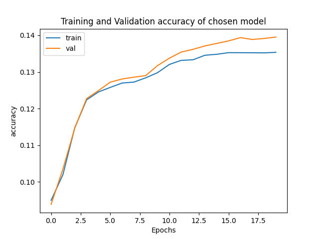

# Introduction

# Embedding

## Approach and design choices

Tokenization

- Using torchtext basic-english tokenizer
- Exclude tokens of names, digits, and spaces

Dataset

- Context size refers to amount of tokens on each side of target.
    total context becomes 2*context_size
- Unknown tokens and punctuations are excluded from targets.

## Training

-- TODO --
Explain training procedure

## Results 

-- TODO --
Report on test performance, cosine similarity, embedding Visualization, and embedding arithmetic.

### Test performance

### Cosine similarity

### Visualization of embedding space

# Conjugation of _have_ and _be_

## Approach and design choices

- Dataset is based on embedding dataset. 
- Only pairs where target is a conjugation of _be_ or _have_ are kept.
- Context size/sequence length refers to the total size of context.

## Training

-- TODO -- 
Explain training, and parameter search

## Results

-- TODO -- 
Report on performance and training/performance time of models

Time is taken on the whole training function,
which includes computing loss and accuracy for both training and validation.

# Text generation

## Approach and design choices

## Training

## Results

### Examples of generated sequences

